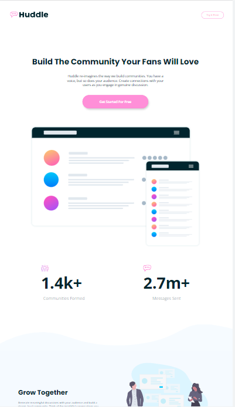

# Frontend Mentor - Huddle landing page with curved sections solution

This is a solution to the [Huddle landing page with curved sections challenge on Frontend Mentor](https://www.frontendmentor.io/challenges/huddle-landing-page-with-curved-sections-5ca5ecd01e82137ec91a50f2). Frontend Mentor challenges help you improve your coding skills by building realistic projects. 

## Table of contents

- [Overview](#overview)
  - [The challenge](#the-challenge)
  - [Screenshot](#screenshot)
  - [Links](#links)
- [My process](#my-process)
  - [Built with](#built-with)
- [Author](#author)
- [Acknowledgments](#acknowledgments)

Users should be able to:

- View the optimal layout for the site depending on their device's screen size
- See hover states for all interactive elements on the page

### Screenshot

### Links

- Solution URL: [https://github.com/manjubhaskar02/FM-4--huddle-landing-page-with-curved-sections-master](https://github.com/manjubhaskar02/FM-4--huddle-landing-page-with-curved-sections-master)
- Live Site URL: [Add live site URL here](https://your-live-site-url.com)

## My process

### Built with

- Semantic HTML5 markup
- CSS custom properties

## Author

- Frontend Mentor - [@manjubhaskar02](https://www.frontendmentor.io/profile/manjubhaskar02)

## Acknowledgments

I always want to thank my hubby, Safaldas who always push me to do the challenges and my mentor Sneha .

